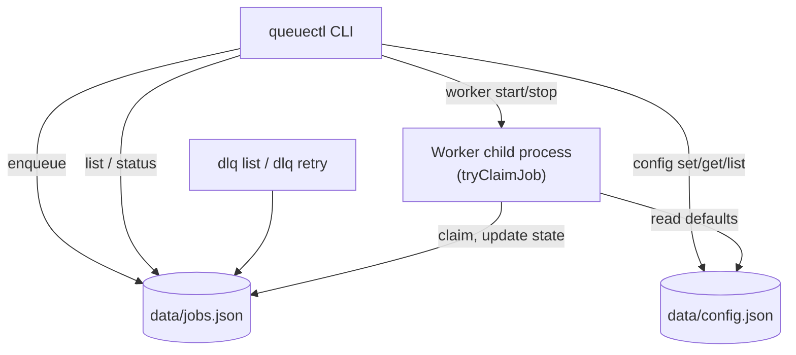
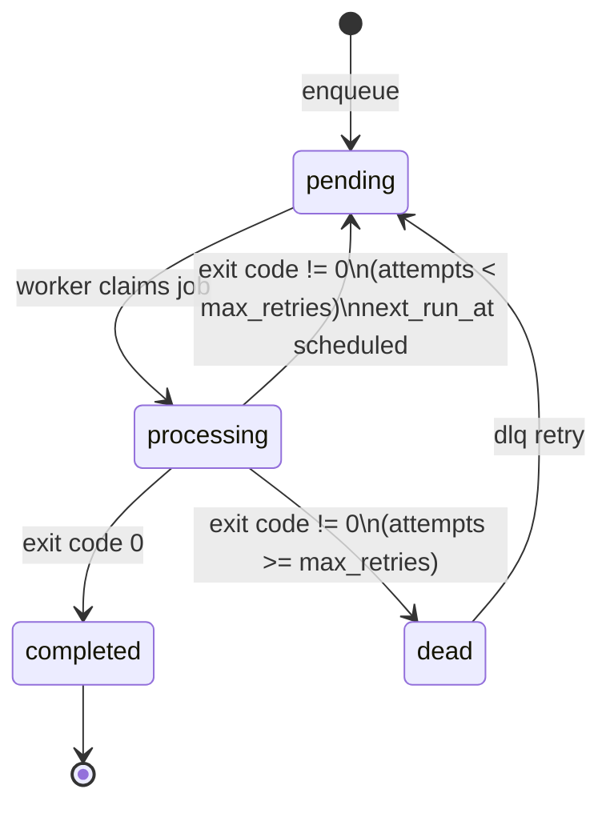

# queuectl Design

## Component Overview

## Job Lifecycle

## Responsibilities

| Module | Responsibility |
|---|---|
| `src/commands/*` | CLI parsing, user-facing messages, command orchestration |
| `src/core/jobModel.js` | Builds and validates job objects, applies defaults |
| `src/core/storage.js` | Reads/writes `data/jobs.json`; atomic temp-file+rename writes; file-locked job claiming |
| `src/core/executor.js` | Runs shell commands, returns success/failure (never throws on a normal command failure) |
| `src/core/retry.js` | Computes exponential backoff delay |
| `src/config/configStore.js` | Reads/writes runtime config (`max_retries`, `backoff_base`) |

## Concurrency Model

`worker start --count N` forks `N` child processes. Each child:

1. Synchronously claims one due, pending job via `tryClaimJob(workerId)`, which
   flips the job to `processing` while holding the file lock — this is what
   prevents two workers from picking up the same job.
2. Executes the job's command.
3. Updates that same job to `completed`, back to `pending` (with `next_run_at`
   set), or `dead`, depending on the result.

## Known Limitation

If a worker crashes mid-job, that job can remain stuck in `processing` with
`locked_by` still set. Recovery of abandoned `processing` jobs is intentionally
out of scope for now — a future milestone could add a staleness check (e.g. a
`processing` job untouched for longer than a threshold gets released back to
`pending`).